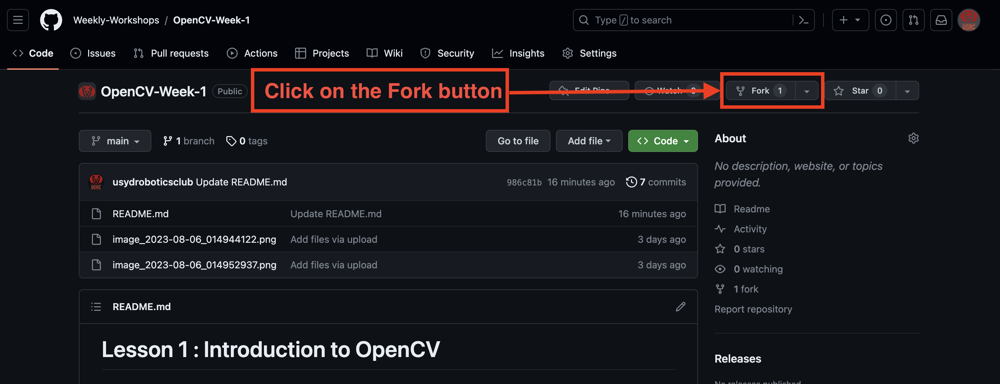
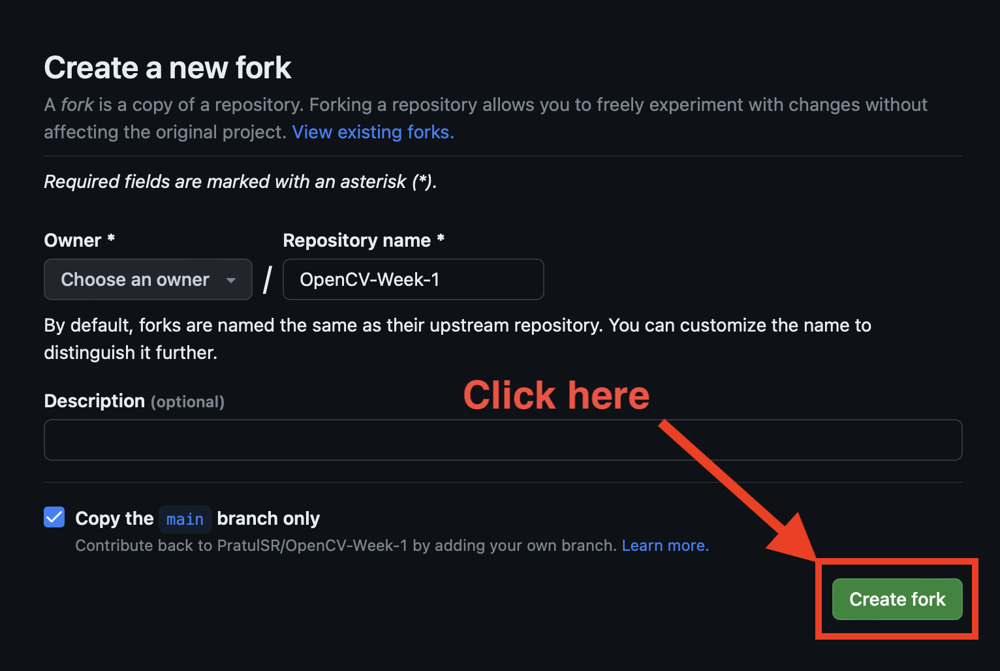
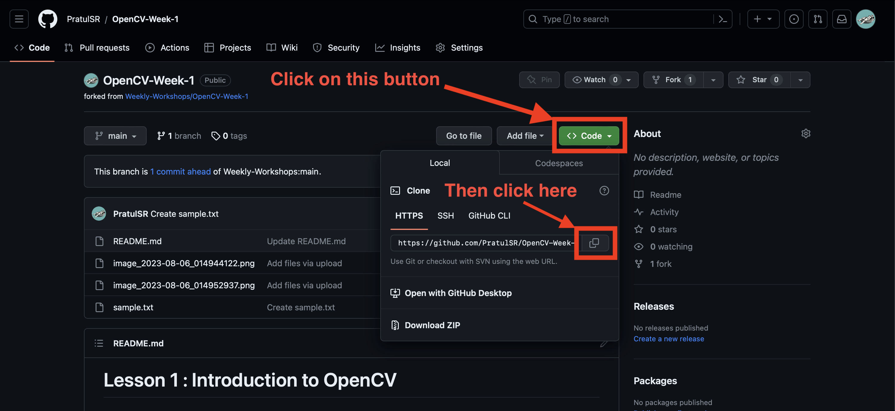

# OpenCV Weekly Workshops (Semester 2, 2023)

This is the official repository for the USRC OpenCV Weekly Workshops!

## The Schedule

| Week | Topic                       | Repository                                            |
|------|-----------------------------|-------------------------------------------------------|
|   1  | Introduction to OpenCV      | [Week - 1](https://github.com/Weekly-Workshops/OpenCV-Week-1.git) |
|   2  | Basic Frame Operations      | [Week - 2](https://github.com/Weekly-Workshops/OpenCV-Week-2.git) |
|   3  | Binary Images               | [Week - 3](https://github.com/Weekly-Workshops/OpenCV-Week-3.git) |
|   4  | Edges and Contours          | [Week - 4](https://github.com/Weekly-Workshops/OpenCV-Week-4.git) |
|   5  | Movement and Face Detection | [Week - 5](https://github.com/Weekly-Workshops/OpenCV-Week-5.git) |

## How to get started

To successfully complete the workshops, just follow the given steps : 

1. Click on the repository link above for whichever workshop you are doing.
2. On the repository page, click on the _Fork_ button (see image below)
   
3. On the page that opens, simply click on the _Create Fork_ button (see image below)
   

4. Congratulations! You have successfully forked the repository!
5. Now, we must clone this forked repository onto your laptop to actually start working on it.
6. To do so, click on the green _Code_ button.
7. Next, click on the copy button (shown in image below) to copy the link to this repository.

8. Now, head over to your terminal on your laptop and type the following command and press enter:
   
`git clone <Paste the copied link>`

9. Now, open the folder on your preferred IDE and start coding!
